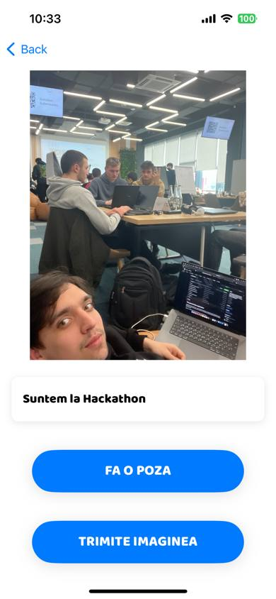

# The general Idea explanation

**App Name:** Silverlink ( Silver Eng. - argint. The elderly generation is considered the "Silver generation", so the app's name comes from the general idea of the app - to link seniors to combat loneliness and all the challenges that come with it)

**Tagline:** Your digital companion for connection, joy, and staying sharp.

**Description:**
Loneliness doesn't have to be part of aging. Silverlink is your friendly, easy-to-use app designed specifically for seniors. Connect with loved ones, rediscover old passions, explore new interests, and feel a little less alone.
## Functionalities
**Base Functions of the app:**
- Local news from multiple Moldovan newsletters
- Mood sharing - so everyone would know how our dear elderly people feel, and offer them corresponding support
- Photo uploading - so the seniors can share memories, how they feel and what they are doing
- Conversations - to connect with their close people
- Social assistant - so they would find answers to the questions they have

Being lonely doesn't only influence people's mentality and emotional state, but many other aspects of their lives as well. Besides mental and emotional challenges, lonely elders can also face physical and practical challenges. These challenges can impact their well-being, independence, and quality of life.

We know that each problem has a solution, and in our project we have approached the most important and common challenges, but all of them can and will be implemented in the future, so our seniors will have a simple app with many functionalities, because our focus is the ease of use, while having a lot of options to choose from.
## Difficulties
Talking in more detail about the challenges the elderly people encounter and the solutions to be implemented in our app, we have the following:
- Physical
	- Chronic health conditions (*Many seniors manage conditions that can limit mobility, increase pain, and necessitate frequent medical care. Some of which can be treated or reduce pain naturally*) - Diseases descriptions with the symptoms and natural solutions to solve them
	- Decreased mobility (*- Physical changes lead to decreased strength, balance, and flexibility. This can make everyday tasks difficult, increase the risk of falls, and contribute to social isolation.*) - Online fitness classes (group activity)
	- Cognitive difficulties (*It is not easy for the elderly people to learn by themselves about technologies and all the functionalities our app will provide.) - Technical tutorials
- Practical:
	- Financial worries (*Many seniors live on fixed incomes, leading to financial stress, particularly with rising healthcare costs.*) - Budgeting tools
	- Transportation difficulties (*Decreased driving ability can make getting to appointments, stores, and social activities a challenge, especially in areas with poor public transit.*) - Accessible Public Transit Maps
	- Navigation difficulties (*Fast-paced technology changes can be difficult to keep up with, creating barriers for online services and connection.*) - "Landmark" Navigation
- Emotional:
	- Loneliness and isolation (*Loss of loved ones, decreased mobility, and retirement can lead to fewer social connections, increasing feelings of loneliness.*) - Intergenerational Exchanges and Events list with online/offline participation
	- Depression and anxiety (*Seniors can be more susceptible to mental health concerns due to life changes, medical conditions, and underlying anxieties.*) - Mindfulness & Mood Support (Guided meditations, breathing exercises, or relaxing music,) Personalized Recommendations (when entering the app, recommend uplifting activities like social interaction, communication, sport)
	- Lack of purpose (*Retirement and changed roles can lead to a feeling of lost purpose, which impacts self-esteem and motivation.*) - Skills Marketplace (a place where elderly people can find interesting skills easy to learn, with step by step tutorials)
## Application Particularities:
1. **Roadmap:**
	- M1-2 Secure user profiles Mood sharing Photo uploading with captions One-on-one text chat Option for voice commands Local news implementation “How-To” Library Large, high-contrast interface 
	- M2-3 The implementation of the solutions for the physical, practical and emotional challenges. Expansion of the “How-To” Library 
	- M4-5 Partner with a local senior center or volunteering community group for testing and refined feedback. Partner with the local telecommunications operator - Moldcell for the deployment of the social assistant (linia fierbinte)
	- M5-6 Team up with organizations providing fitness classes, mental health resources, etc. Collaborate with reliable medical sources for trusted info. Collaborate with volunteering communities to realize the intergenerational exchange. Translation features.
2. **Challenges (Overcoming):**
	- **Secure Data Handling**: Invest early in robust security architecture and privacy policies.
	- **Intuitive Voice Commands:** Work with diverse seniors during development to refine accuracy.
	- **News Partnerships:** Focus on a few high-quality news sources initially for manageable integration.
	- **Content Quality**: Collaborate with occupational therapists (for safe exercises), reputable websites (for vetted info).
	- **Scope Creep**: Start with 2-3 well-executed solutions, rather than many half-baked ones.
	- **Emotional Support**: Provide curated links to established mental health hotlines and websites.
	- **Senior Center Engagement**: Respect that building trust with seniors takes time.
	- **Social Assistant Complexity**: Start discussing social assistant functionality with Moldcell early.
	- **Feedback Overload**: Design feedback forms to focus on specific features and overall usability.
	- **Finding the Right Partners**: Thoroughly assess the credibility and values of potential partners.
	- **Reliable Medical Info**: - Medical Advisor
	- **Managing Translation**: Begin with key features translated, prioritizing clarity over quantity.
2. **How the app Works (Technical):**
	- **App-Based:** For smartphone users, the app provides the AI assistant, features, and a senior-friendly interface.
	- **Phone-Based:** For those without smartphones, a dedicated phone number connects them directly to the AI assistant.
3. **AI Social Assistant:**
	- Accessible by voice command (in-app or through a simple phone call)
	- Provides friendly interaction and answers users' questions
4. **Understanding Our User Projections**
	- **Potential Reach:** We believe our app could help up to 60,000 seniors in Moldova. This represents around 10% of the country's senior population.
	- **Daily Engagement:** We anticipate approximately 6,000 seniors (10-11% of our potential audience) will use the app each day.   
	- **AI Assistant Popularity:** We expect about half of those daily users, around 3,000 seniors, will interact with our AI assistant on a regular basis
	- **Request Volume:** On average, each AI assistant user is likely to make about 5 requests to the assistant per day.
	1. **Important Notes:**
		- These are optimistic projections. Actual user numbers might fluctuate.
		- We aim to grow these numbers over time through outreach and app improvements.
5. **App Costs Explained**
	- **App Store Deployment:** There's a yearly fee of $100 to acquire the developer kit, used to publish the app on the Apple app store.
	- **Telecommunications Partnership:** We are thinking about a partnership with Moldcell, a local telecommunications provider. This means seniors without smartphones can access our AI assistant for free by calling a special number.
	- **Language Model:** The AI assistant that powers our app needs a language model to function. This costs approximately $50 per month. (Google Vertex AI)
	- **Cloud Storage:** To store user data (photos, conversations, etc.), we'll need cloud storage. We estimate this will cost around $10 per month. (Google Cloud)
	- **Advertising:**
	    - **Ideal Scenario:** We hope to collaborate with community organizations to advertise our app at little to no cost. This could include promotion through senior centers and volunteer groups.
	    - **Backup Plan:** If needed, we've budgeted $140 per month for radio and offline advertising, which effectively reaches our senior audience.

## Getting started

1. **Accessing the App**
	To ensure a seamless and secure experience, users will follow a simple one-time setup process:
	1. **Initial Account Creation:** Upon first launching the app, the user will be prompted to create an account.
	2. **Phone Number as Identifier:** The user's phone number serves as their unique login credential. This provides a convenient and familiar method to access the app.
	3. **Password Setup:** The user will choose a secure password. This adds an important layer of protection for their personal information and app activities.
	**Subsequent Logins:** After the initial setup, users will simply access the application without the need of logging in again.
	**Security Considerations**
	- Phone numbers offer a simple and widely recognized method of identification.
	- The user's password is essential to safeguarding their account and should be kept confidential.
	
 

  
	

2. **A Clear and User-Friendly Home Screen**
	The Silverlink app is designed with seniors in mind, ensuring a clear and uncluttered interface. The home page presents the app's core functionalities in a way that is easy to understand and navigate.
	**Large, Recognizable Icons:** Four prominent icons, each representing a key function, occupy the central area of the screen. These icons are large and use universally understood symbols:
	- **Newspaper:** Represents the local news section.
	- **Smiley Face:** Represents the mood sharing feature.
	- **Camera:** Represents the photo uploading feature.
	- **Speech Bubble:** Represents the messaging feature for conversations.
	
	**Accessibility Features:** Considering potential visual limitations, the app uses high-contrast colors and large fonts throughout the interface. This ensures clear readability for all users.
	
	**Straightforward Text Labels:** Each icon is accompanied by a brief text label that clearly identifies its function. These labels use simple, easy-to-understand language suitable for seniors with varying levels of technical experience.
	
	**Social Assistant Integration:** For users who prefer voice interaction, a dedicated button or voice prompt can activate the social assistant directly from the main page. This eliminates the need to navigate through multiple menus.
	
	By combining clear visuals, simple text labels, and easy access to the social assistant, the Silverlink app empowers seniors to comfortably explore and utilize all the app's features, fostering connection and a sense of community.
		

	  		
		

4. **The Senior-Friendly News Experience**
	Silverlink’s news page is designed to be clear, accessible, and engaging for older adults.
	- **Large, Readable Text:** News articles are displayed in a large font size, ensuring easy readability for users with varying visual abilities.
	- **Simple Layout:** The page avoids clutter and uses a clean layout to focus on the content. This makes it easier for seniors to find the information they're looking for without getting overwhelmed.
	- **Article Snippets with Source:** Headlines and brief summaries are presented for each news story. This allows users to quickly scan and identify articles of interest. Tapping on the summary will open the full article.
	- **Original Site and Text-to-Speech Options:** For users who want to delve deeper, an option is provided to access the original website of the news article. 
	- The text-to-speech function can be activated to have the article read aloud, promoting comfortable information access for users who prefer audio or have difficulty reading extended text.
	- **Intuitive Navigation:** Swiping left or right on the screen allows users to easily transition between articles, mimicking the familiar action of turning pages in a book or magazine. This intuitive gesture-based navigation makes it simple for seniors to explore the news section at their own pace.
	By incorporating these features, Silverlink caters to the specific needs of elderly users, empowering them to stay informed and connected to the world around them in a comfortable and frustration-free way.
	

	  		
		

5. **Easy-to-Use AI Assistant for Seniors**

	Silverlink is designed to be easy and comfortable for seniors to use, regardless of their prior experience with technology. A key feature is the voice-activated AI assistant, accessible with a simple press of a button on the app's home screen (as depicted in the image).
	
	- **Simple Activation:** No need to remember complex commands or navigate through menus. A single press activates the assistant.
	- **Speech Recognition:** The AI listens attentively as the senior speaks his or her question or request.
	- **Processing and Response:** Once the user releases the button, the AI processes the question and formulates a response. This response is then delivered in a clear, natural-sounding voice.
	
	**Why Voice-to-Voice is Perfect for Seniors**
	Voice-to-voice interaction offers several advantages for seniors compared to traditional text-based interfaces:
	- **More Natural Communication:** Speaking is often easier and more intuitive than typing, especially for those with limited dexterity or visual impairments.
	- **Reduced Reliance on Vision:** Voice control allows seniors with vision problems to interact with the app independently.
	- **Increased Confidence:** The ability to interact naturally can boost self-confidence and encourage exploration of the app's features.
	
	**Impact on Everyday Life**
	Silverlink's voice-activated AI assistant has the potential to significantly improve the lives of seniors in a multitude of ways:
	- **Reduced Isolation:** The AI can provide companionship and conversation, helping to combat loneliness and social isolation.
	- **Increased Independence:** Seniors can access information, complete tasks, and get help with daily needs, maintaining their independence for longer.
	- **Improved Well-being:** By reducing loneliness and increasing social interaction, the AI assistant can contribute to a better overall sense of well-being for seniors.

	Overall, Silverlink's user-friendly AI assistant removes technological barriers and empowers seniors to connect, access information, and live more fulfilling lives.
	
 	

	  		
		

6. **Photo Sharing for Seniors**
	Silverlink empowers seniors to stay connected with loved ones through a user-friendly photo-sharing feature. This functionality is designed to be intuitive and easy to use, regardless of a user's prior experience with technology.
	- **Simple Capture:** The app allows seniors to take pictures directly within the app's interface, eliminating the need to switch between different applications. (This can be especially helpful if their phone doesn't have a camera app readily accessible).
	- **Seamless Uploading:** Uploading captured photos is a breeze. With a few taps within the app, seniors can share their cherished moments with family and friends.
	
	**Silverlink Bridges the Distance**
	This photo-sharing feature is more than just a technical capability; it fosters social connection and combats feelings of isolation.
	- **Sharing Life's Moments:** Seniors can easily capture and share photos of everyday activities, special occasions, or treasured keepsakes.
	- **Staying Connected with Loved Ones:** Grandchildren, children, or distant relatives can cherish these shared photos, providing a window into the senior's life and fostering a stronger sense of connection.
	- **Combating Loneliness:** Sharing photos can spark conversations and memories, reminding seniors that they are cared for and loved.
	
	**Overall, Silverlink's photo-sharing feature empowers seniors to share their lives effortlessly, bridging the gap between generations and strengthening social connections.**

   

	  		
		

